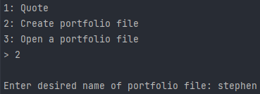

# Portfolio Tracker

## Get started

### Installing Dependencies

Follow the [installation steps](https://fmt.dev/latest/usage.html) for get access to the fmt library.

To install libcurl, run `sudo apt-get install libcurl-dev` on UNIX or follow the [steps to build the library](https://curl.se/docs/install.html) locally for Windows.

Run `make` to start tracking your portfolio!

## Displaying Profiles

After opening a file, selecting the second option displays your entire portfolio, including total profit/loss and current price of each asset owned.

## Add new assets

When adding to or creating portfolios, keep track of your stocks and cryptocurrencies with the latest price data.

## Note

IEXCloud no longer offers a free plan for their APIs
